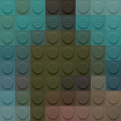
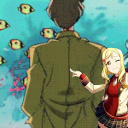

# Çerçeve api

### Belirlediğiniz linke lego filtersi uygular

* Metot: **GET**
* Url: **https://api.codare.fun/cerceve/lego?avatar=link**
* Örnek Çıktı:
*   

### Belirlediğiniz linke sarıl çerçevesi uygular

* Metot: **GET**
* Url: **https://api.codare.fun/cerceve/sarıl?avatar=link**
* Örnek Çıktı:
*   

### Belirlediğiniz linke sivas çerçevesi uygular

* Metot: **GET**
* Url: **https://api.codare.fun/cerceve/sivas?avatar=link**
* Örnek Çıktı:
*   

### Belirlediğiniz linke anime kızı çerçevesi uygular

* Metot: **GET**
* Url: [**https://api.codare.fun/**](https://api.codare.fun/)**cerceve/anime?avatar=link**
* Örnek Çıktı:
*   

### Belirlediğiniz linke ak parti çerçevesi uygular

* Metot: **GET**
* Url: [**https://api.codare.fun/**](https://api.codare.fun/)**cerceve/ak-parti?avatar=link**
* Örnek Çıktı:
*   

### Belirlediğiniz linke kızgınım çerçevesi uygular

* Metot: **GET**
* Url: [**https://api.codare.fun/**](https://api.codare.fun/)**cerceve/kızgınım?avatar=link**
* Örnek Çıktı:
*   

### Belirlediğiniz linke RTE çerçevesi uygular

* Metot: **GET**
* Url: [**https://api.codare.fun/**](https://api.codare.fun/)**cerceve/rte?avatar=link**
* Örnek Çıktı:
*   

### Belirlediğiniz linke imposter çerçevesi uygular

* Metot: **GET**
* Url: [**https://api.codare.fun/**](https://api.codare.fun/)**cerceve/imposter?avatar=link**
* Örnek Çıktı:
*   

### Belirlediğiniz linke İstanbul Sözleşmesi çerçevesi uygular

* Metot: **GET**
* Url: [**https://api.codare.fun/**](https://api.codare.fun/)**cerceve/istanbul?avatar=link**
* Örnek Çıktı:
*   

### Belirlediğiniz linke Kuran Yaşatır çerçevesi uygular

* Metot: **GET**
* Url: [**https://api.codare.fun/**](https://api.codare.fun/)**cerceve/kuran-yaşatır?avatar=link**
* Örnek Çıktı:
*   

### Belirlediğiniz linke balance çerçevesi uygular

* Metot: **GET**
* Url: [**https://api.codare.fun/**](https://api.codare.fun/)**cerceve/balance?avatar=link**
* Örnek Çıktı:
*   

### Belirlediğiniz linke bravery çerçevesi uygular

* Metot: **GET**
* Url: [**https://api.codare.fun/**](https://api.codare.fun/)**cerceve/bravery?avatar=link**
* Örnek Çıktı:
*   

### Belirlediğiniz linke brilliance çerçevesi uygular

* Metot: **GET**
* Url: [**https://api.codare.fun/**](https://api.codare.fun/)**cerceve/brilliance?avatar=link**
* Örnek Çıktı:
*   

