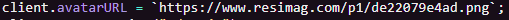

# Dashboard Kurulum

selam arkadaşlar botu kendinizin botunu eklemek için yapmanı gerekenler şunlar 1\)config.js ye geliyorum  
2\)[https://discordapp.com/developers](https://discordapp.com/developers) sitesine geliyoruz  
 3\)Giriş yapmadıysak giriş yapıyoruz  
 4\)Applications bölümünden botunuza tıklayın [https://kong.is-inside.me/MvauhvzN.png](https://kong.is-inside.me/MvauhvzN.png)   
5\)General Information bölümünden CLIENT SECRET ımızı kopyalıyoruz [https://kong.is-inside.me/uFLJ4RXi.png](https://kong.is-inside.me/uFLJ4RXi.png)  
 6\)config.js deki oauthSecret bölümüne yapıştırıyoruz örn; "oauthSecret": "kopyaladığınız id", [https://kong.is-inside.me/H42vaxkx.png](https://kong.is-inside.me/H42vaxkx.png)   
7\)OAuth2 a tıklıyoruz[https://kong.is-inside.me/PhPnh57z.png](https://kong.is-inside.me/PhPnh57z.png)   
8\)Add Redirects a basıyoruz [https://kong.is-inside.me/MO28CQT8.png](https://kong.is-inside.me/MO28CQT8.png)   
9\)Buraya sitenizin urlsinin sonuna /callback ekliyoruz örn [https://dashim.glitch.me/callback](https://dashim.glitch.me/callback) [https://kong.is-inside.me/V7iZJwU0.png](https://kong.is-inside.me/V7iZJwU0.png)   
10\)Sonra saveliyoruz [https://kong.is-inside.me/deuc5iB3.png](https://kong.is-inside.me/deuc5iB3.png)   
11\)Ardından config.js ye gelip callbackURL kısmına OAuth2 ayarkadığımız siteyi giriyoruz benimki [https://dashim.glitch.me/callback](https://dashim.glitch.me/callback) di "callbackURL": `https://dashim.glitch.me/callback`, yapcam yani


Vortex için:  
Anasayfa 229. satır siyah yazının sonunda --&gt; ekleyin


### Vortex için:

1-\)bu şekilde olucak olmaz ise siliniz siyah kısmı.

2-\)htmllerde burada vortexbot.org gibi site ismi yazar onları kendininizkiyle değişin.  
/kullanıcı /panel /komutlar kalıcak şeklinde hepsine yapın

3-\)Arkadaşlar DESTEK SUNUCU sorunu için o komutun üst kısmında guild id olucaktır. Oraya kendi DESTEK SUNUCU ID sini girin. Sorununuz çözülecektir.  
  
4-\)Komut çalışmama sorunu için 1. resimdeki \(üst\) kısmı silin. 2. Resimdeki komutun alt kısmındaki belirttiğim yeri siliniz.

5-\)Resim değiştirmek isteyen

bu linki değişsin index.js 119. satır  
client.avatarURL = \`[**https://www.resimag.com/p1/de22079e4ad.png**](https://www.resimag.com/p1/de22079e4ad.png)**\`**

6-\)

7-\)Eğer bu hatayı alırsanız html/panel/footer.ejs adında dosya açın.

